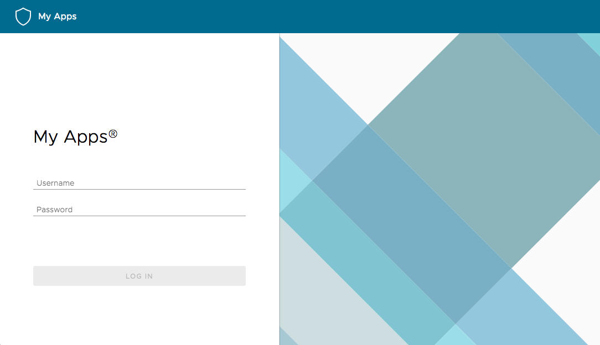
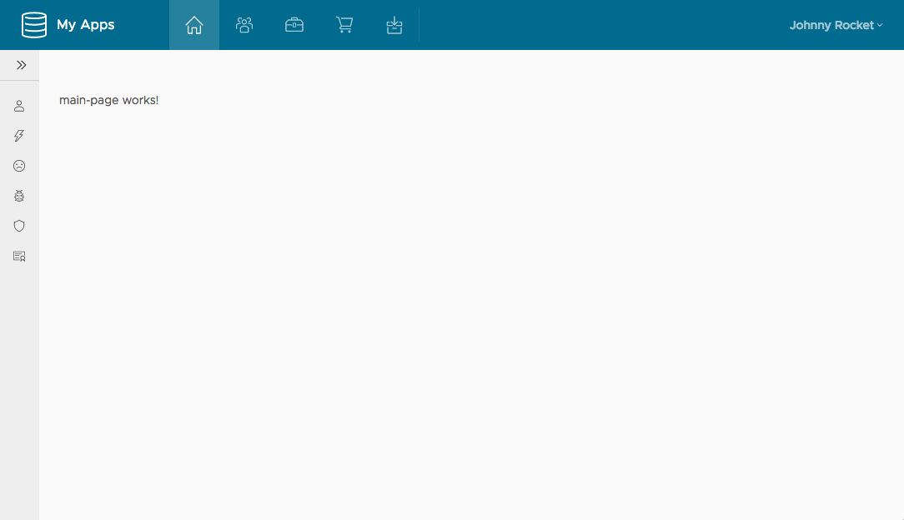

# Clarity and Angular 4 seed template

## Installation

```
git clone https://github.com/siteslave/clarity-angular4-web.git

cd clarity-angular4-web

npm i
```

## Running app

```
ng serve
```

app url `http://localhost:4200`  

username: `admin` and password: `admin`
## Building

```
ng build --prod
```

## Screen short


